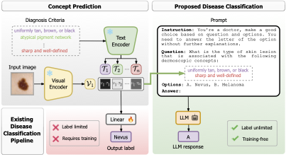

# A Two-Step Concept-Based Approach for Enhanced Interpretability and Trust in Skin Lesion Diagnosis 🩺

## Abstract
The main challenges hindering the adoption of deep learning-based systems in clinical settings are the scarcity of annotated data and the lack of interpretability and trust in these systems. Concept Bottleneck Models (CBMs) offer inherent interpretability by constraining the final disease prediction on a set of human-understandable concepts. However, this inherent interpretability comes at the cost of greater annotation burden. Additionally, adding new concepts requires retraining the entire system. In this work, we introduce a novel two-step methodology that addresses both of these challenges. By simulating the two stages of a CBM, we utilize a pretrained Vision Language Model (VLM) to automatically predict clinical concepts, and a Large Language Model (LLM) to generate disease diagnoses based on the predicted concepts. We validate our approach on three skin lesion datasets, demonstrating that it outperforms traditional CBMs and state-of-the-art explainable methods, all without requiring any training and utilizing only a few annotated examples.

<p align="center"></p>


## ⚡️ Highlights 🔥  
- We introduce a novel two-step approach for concept-based explainability in skin lesion diagnosis that can provide the final diagnosis class without the need for additional training;
- We reduce the annotation burden associated with CBMs by leveraging the zero-shot capabilities of pretrained Vision-Language Models (VLMs) to automatically predict the presence of concepts;
- We provide the final diagnosis class through the use of a tailored prompt and using the few-shot capabilities of LLMs;
- Finally, our approach demonstrates superior performance compared to traditional CBMs across three public benckmarks.

---

## 1. Download data
- **PH $^2$** dataset: https://www.fc.up.pt/addi/ph2%20database.html
- **Derm7pt** dataset: https://derm.cs.sfu.ca/Welcome.html
- **HAM10000** dataset: https://dataverse.harvard.edu/dataset.xhtml?persistentId=doi:10.7910/DVN/DBW86T

1.1 After downloading data, the directory structure of `data` folder should look like this:
```bash
.
└── data/
    ├── PH2/
    │   ├── images/
    │   │   ├── IMD002.jpg
    │   │   └── ...
    │   └── splits/
    │       ├── PH2_train_split_0.csv
    │       └── ...
    ├── Derm7pt/
    │   ├── images/
    │   │   └── Aal002.jpg
    │   └── splits/
    │       ├── derm7pt_train.csv
    │       └── ...
    ├── HAM10000/
    │   ├── images/
    │   │   └── ISIC_0024306.jpg
    │   └── splits/
    │       ├── HAM10000_train.csv
    │       └── ...
    └── ...
``` 

You should copy the downloaded images to the `images/` folder in each dataset's folder. If you have any trouble with downloading datasets/images, please e-mail me at *cristiano [dot] patricio [at] ubi [dot] pt*.

## 2. Installation


2.1 Clone this repository and navigate to the folder:
```bash
git clone https://github.com/CristianoPatricio/2-step-concept-based-skin-diagnosis.git
cd 2-step-concept-based-skin-diagnosis/
```

2.2 Create a new conda environment and install required libraries contained in `requirements.txt` file:

```bash
conda create --name 2-step-skin python=3.10
conda activate 2-step-skin
pip install -r requirements.txt
```

## 3. Demo

Run the following command to interact with our two-step approach through a web demo hosted by Gradio:

```bash
python demo/app.py
```

## 4. Reproduce experiments

**Note:** For experiments with ExpLICD, you need to clone the `Explicd` repository into `2-step-concept-based-skin-diagnosis/src/` folder.

```bash
cd src/
git clone https://github.com/yhygao/Explicd.git
```

Then, download the .pth checkpoint of the pretrained ExpLICD on ISIC 2018 from [Google Drive](https://drive.google.com/file/d/1jl33-St8ksbivpE5t5PSsrVBL49p4pwU/view?usp=share_link) and move it to the `checkpoints` folder.

For the experiments with CBI-VLM, refer to the [this repository](https://github.com/CristianoPatricio/concept-based-interpretability-VLM).

3.1 [Table 4] Predict class label from image features ($x \rightarrow y$)
```bash
./scripts/run_x_to_y.sh 0    # GPU ID: 0
```

3.2 Few-shot disease classification

**Note:** You'll need to download the pre-computed visual features from [Google Drive](https://drive.google.com/file/d/1uZgiHltaCqA2ldMbk7MOZj5jJPt9-uQf/view?usp=sharing) and move it to the `data/visual_features` folder. You could also download the generated concepts ($x \rightarrow c$) for each model from [Google Drive](https://drive.google.com/file/d/1wHdHxMVI8eis_V49PnHvIOk9acjrP2dk/view?usp=sharing) and move it to the `data/concept_prediction` folder.

```bash
./scripts/run_x_to_c_to_y.sh 0  # GPU ID: 0
```

3.3 VLM + Linear Classifier

```bash
./scripts/run_vlm_linear_classifier.sh 0  # GPU ID: 0
```

## Solutions for Possible Issues

**Issue #1**: *Access to model mistralai/Mistral-7B-Instruct-v0.3 is restricted. You must have access to it and be authenticated to access it. Please log in.*

Solution: Signing in your hugging face account via terminal `huggingface-cli login`, and then enter your token.

## Citation

If you use this repository, please cite:

```
@article{patricio2024two,
  title={A Two-Step Concept-Based Approach for Enhanced Interpretability and Trust in Skin Lesion Diagnosis},
  author={Patr{\'\i}cio, Cristiano and Teixeira, Lu{\'\i}s F and Neves, Jo{\~a}o C},
  journal={arXiv preprint arXiv:2411.05609},
  year={2024}
}
```